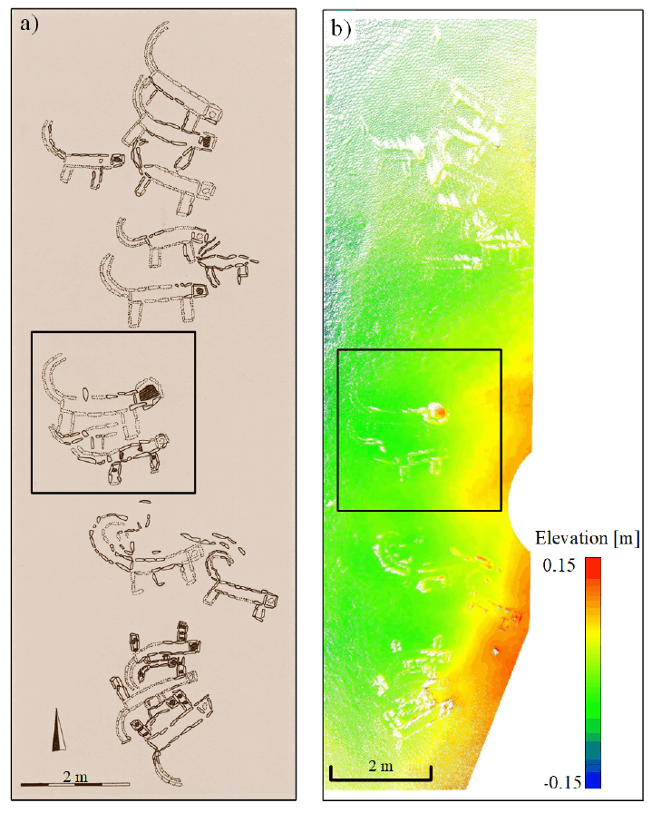
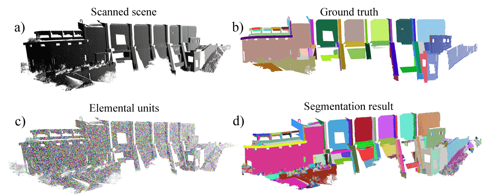
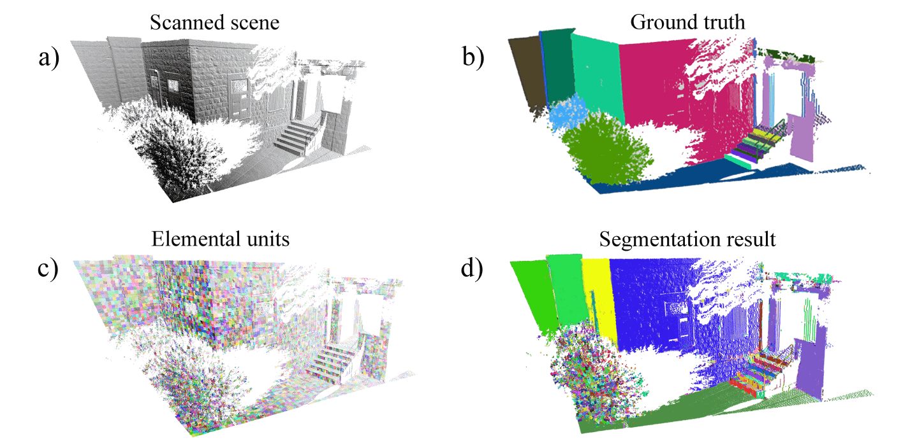

# FILIN_INFRASTRUCTURE: A Modern Tool for Geometry Analysis for Images and Point Cloud
This is the infrastructure package for point clouds and raster data processing in The Photogrammetry and Laser Scanning Lab in the Technion. For more information of our group, please visit the homepage of [Professor Sagi Filin][1].

## **Core Features**
1. **The infrastucture is object oriented.** There are three data-set object ( PointSet, PointSubSet and RasterData) which have a basic set of properties, Factoy objects and Property objects. 

1. The **Property objects** relate to the data-set, and are built by a Factory object. In each **Factory** there are **several functions** that **build the same property**, but with a different algorithm. 

1. There are also visualization classes via which visualization of the point cloud is possible.

  [1]: https://cee.technion.ac.il/members/sagi-filin/

## **What do we offer?**


 1. [Saliency:](https://www.researchgate.net/publication/343400402_SALIENCY_OF_SUBTLE_ENTITIES_WITHIN_3-D_POINT_CLOUDS) Point-based saliency 
 
|Example 1 | Example 2|
|----------|----------|
|||

2. [Segmentation:](https://www.isprs-ann-photogramm-remote-sens-spatial-inf-sci.net/V-2-2020/273/2020/) 
HIERARCHICAL PROXIMITY-BASED OVER-SEGMENTATION
 
|Example 1 | Example 2|
|----------|----------|
|||

3. **AND MORE**

## **How to install ?**

Step 1: Download the repo from the given address
```bash
git clone url_of_the_repo
```
Step 2: Check the python version of your pc, and install requirements from the given file.
* We support python 3.6
* Windows and Linux [requirement_win10.txt and requirement_linux.txt]
```bash
pip install requirement_YourPlatform.txt
```

### **To work within the infrastructure, please check the documentation in the [docs/index.html]**.

Enjoy! :wink:

You can find the name of those contributors in the [homepage][1]. Special thanks to Reuma Arav.


